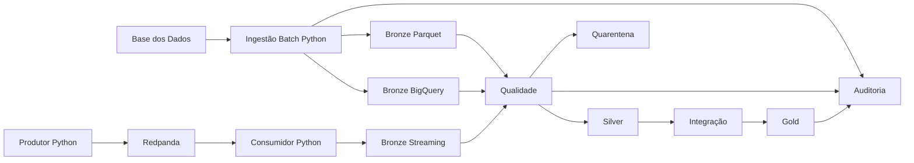

# Tech Challenge – Fase 2 — Pipeline Híbrido para Análise da Alfabetização no Brasil

**Aluna:** Ana Beatriz Pastori dos Santos
**RM:** 372884

Pipeline híbrida (Batch + Streaming) de engenharia de dados sobre a
alfabetização no Brasil, seguindo a **Arquitetura Medalhão** (Bronze, Silver,
Gold), com qualidade, quarentena, auditoria, observabilidade, FinOps e
governança — **sem serviços pagos**, usando **BigQuery Sandbox**, **Parquet** e
**Redpanda** local.

## 1. Contexto da alfabetização

A alfabetização é um indicador estruturante de políticas públicas. Comparar
resultados observados com metas por município, UF e Brasil ajuda a priorizar
investimentos e reduzir desigualdades regionais.

## 2. Problema de negócio

Os dados de diretórios, metas e indicadores educacionais estão dispersos e em
granularidades diferentes. É preciso **integrá-los de forma confiável** para
responder: *quais municípios atingiram a meta? Qual a evolução da taxa? Onde
estão as maiores lacunas?*

## 3. Objetivo técnico

Demonstrar uma pipeline híbrida com ingestão Batch e Streaming, qualidade de
dados, integridade referencial, produtos analíticos e observabilidade, com uso
adequado de Git, testes e CI.

## 4. Escopo

Ingestão Batch (Base dos Dados) + Streaming local (Redpanda) → Bronze → Silver
(qualidade/quarentena) → Integração → Gold (produtos analíticos) → Auditoria.

## 5. Fontes

| Entidade | Fonte | Estado |
| --- | --- | --- |
| Município | `basedosdados.br_bd_diretorios_brasil.municipio` | ✅ Validada |
| UF | Derivada de município + referência oficial | ✅ Derivada |
| Metas (Brasil/UF/Município), Indicador, Aluno | a validar | ⛔ Pendente (BQ indisponível) |

Detalhes em [docs/source_inventory.md](docs/source_inventory.md) e
[docs/data_dictionary.md](docs/data_dictionary.md).

## 6. Limitações

Neste ambiente o **BigQuery está inacessível** (auth/SSL) e o **Docker daemon**
não estava em execução; por isso a descoberta de fontes educacionais e a
execução em nuvem/streaming ao vivo ficam pendentes de ação humana. Nada foi
inventado. Ver [docs/blockers.md](docs/blockers.md) e
[docs/source_limitations.md](docs/source_limitations.md).

## 7. Arquitetura

Arquitetura Medalhão com dois fluxos (Batch e Streaming) convergindo para a
Silver e alimentando a Gold; auditoria transversal.

## 8. Diagrama



## 9. Fluxo Batch

`Fonte → extração configurável (dry run + maximum_bytes_billed) → Parquet Bronze
+ Bronze BigQuery → qualidade → Silver → integração → Gold`. Cada fonte é
descrita em `config/sources.yaml` e processada por uma interface comum
(`src/batch/`).

## 10. Fluxo Streaming

`Produtor → Redpanda → Consumidor (valida schema, deduplica, quarentena,
latência) → Bronze streaming → microbatch (Parquet) → Silver/Gold`. Nunca há
streaming direto do BigQuery.

## 11. Bronze

Dados brutos + metadados (`_ingestion_id`, `_ingestion_timestamp`,
`_source_*`, `_load_type`, `_record_hash`, `_schema_version`). Histórico em
Parquet particionado por `ingestion_date=`.

## 12. Silver

Dados limpos, padronizados e validados, com `_quality_status` e
`_silver_processed_timestamp`. Invariantes: `bronze = válidos + inválidos` e
`válidos = carregados`.

## 13. Gold

Produtos analíticos: `indicador_municipio_ano`, `meta_vs_resultado`,
`evolucao_temporal`, `resumo_uf`, `ml_features_municipio`. Regras em
[docs/relationship_matrix.md](docs/relationship_matrix.md).

## 14. Qualidade

Motor declarativo reutilizável (`EntityQualitySpec` + `run_quality`). Regras em
[docs/quality_rules.md](docs/quality_rules.md).

## 15. Quarentena

Registros inválidos preservados em
`data/quarantine/<entidade>/processing_date=YYYY-MM-DD/` — nunca descartados.

## 16. Auditoria

JSON por execução + JSON Lines (`pipeline_runs`, `quality_results`,
`streaming_metrics`) + tabelas BigQuery de auditoria.

## 17. Monitoramento

Logs estruturados + relatório consolidado
(`scripts/generate_monitoring_report.py`). Ver [docs/monitoring.md](docs/monitoring.md).

## 18. FinOps

Sandbox sem faturamento, dry run, `maximum_bytes_billed`, colunas explícitas,
Parquet/Snappy, cache e idempotência. Ver [docs/finops.md](docs/finops.md).

## 19. Segurança e governança

`.env` e credenciais fora do Git; anonimização de aluno; nenhum dado pessoal na
Gold. Ver [docs/security_and_governance.md](docs/security_and_governance.md).

## 20. Trade-offs

- **Snapshot Bronze no Sandbox** (histórico em Parquet) — economia e simplicidade.
- **UF derivada** em vez de tabela não validada — determinismo e honestidade.
- **Leitura injetável** — permite execução/testes offline sem quebrar o fluxo BQ.

## 21. Aplicações em IA

Predição de taxa, classificação de risco de não atingir meta, clusterização.
Ver [docs/ai_applications.md](docs/ai_applications.md).

## 22. Estrutura do repositório

```text
config/    settings.yaml, sources.yaml
sql/       consultas versionadas
src/       batch, bronze, silver, gold, quality, streaming, common, cli
scripts/   run_pipeline.ps1, generate_monitoring_report.py
tests/     unit (raiz), contracts/, integration/, e2e/
docs/      documentação técnica
```

## 23. Pré-requisitos

Windows + PowerShell, Python 3.12, Docker Desktop (para streaming), conta Google
com BigQuery Sandbox.

## 24. Configuração

```powershell
python -m venv .venv
.\.venv\Scripts\Activate.ps1
pip install -r requirements.txt
Copy-Item .env.example .env   # ajuste as variáveis
```

## 25. Execução local

```powershell
python -m src.cli validate-config
python -m src.cli batch --source uf     # funciona offline (derivada)
python -m src.cli silver --entity uf
python -m src.cli gold
python -m src.cli all
./scripts/run_pipeline.ps1
```

## 26. Execução Docker (streaming)

```powershell
docker compose up -d redpanda
python -m src.cli stream-producer --events 20 --interval 2
python -m src.cli stream-consumer --max-events 20
docker compose down
```

## 27. Testes

```powershell
python -m ruff check .
python -m pytest -q
python -m pytest --cov=src --cov-report=term-missing
```

## 28. Tabelas criadas

Bronze/Silver: `municipio`, `uf`, `meta_brasil`, `meta_uf`, `meta_municipio`,
`indicador_alfabetizacao`, `aluno` (conforme fontes validadas). Gold: os cinco
produtos. Audit: `pipeline_runs`, `quality_results`, `streaming_metrics`.

## 29. Consultas de exemplo

```sql
SELECT sigla_uf, ROUND(AVG(taxa_alfabetizacao), 2) AS media
FROM `rising-reserve-352718.tc_alfabetizacao_gold.indicador_municipio_ano`
GROUP BY sigla_uf ORDER BY media DESC;
```

## 30. Resultados

Offline, o fluxo da entidade **UF** roda ponta a ponta (27 registros:
batch → silver → gold/auditoria). Os demais dependem do desbloqueio do BigQuery.
Ver [docs/final_validation_report.md](docs/final_validation_report.md).

## 31. Problemas conhecidos

BigQuery inacessível (auth/SSL) e Docker daemon parado neste ambiente — ambos
com ação humana documentada em [docs/blockers.md](docs/blockers.md).

## 32. Próximos passos

Validar as fontes educacionais reais e habilitá-las em `sources.yaml`; materializar
Gold com dados reais; treinar um modelo de IA a partir de `ml_features_municipio`.

## 33. Autora

Ana Beatriz Pastori dos Santos — RM 372884.
